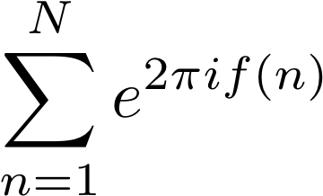

# Exponential Sums

An exponential sum is represented by the following equation



where the exponential is a complex number. The function f(n) is a real-valued function defined for a sequence of positive integers. The Python package `expsum` plots the exponential sum in the complex plane as a progression of partial sums. The x-axis on the plot is the real part and the y-axis is the imaginary part.

This project is inspired by John Cook's article "[Exponential sums make pretty pictures][1]".

## Installation and Usage

Requires Python 3, NumPy, and Matplotlib.

Clone this repository and run the following command:

```bash
>>> python expsum func1 2000 10 7 17
```

Create an animated plot by passing the optional `--anim` argument:

```bash
>>> python expsum func1 2000 10 7 17 --anim
```

## Examples

Examples of the functions available in the `expsum` package are shown below.

### Function 1


```bash
>>> python expsum func1 2000 10 7 17
```


```bash
>>> python expsum func1 8000 11 21 31
```


### Function 2


```bash
>>> python expsum func2 1200 100
```


```bash
>>> python expsum func2 4000 800
```


### Function 3


```bash
>>> python expsum func3 1000
```


```bash
>>> python expsum func3 4000
```


### Function 4


```bash
>>> python expsum func4 4000 4
```


### Function 5


```bash
python expsum func5 4000 50 100
```


### Function 6


```bash
>>> python expsum func6 2000 4
```


### Function 7


```bash
>>> python expsum func7 8000 4
```


## Contributing

Submit a Pull Request if you would like to contribute to this project. Questions and other comments can be submitted on the Issues page. Another way to contribute is by making a small donation to the Tip Jar.

## Tip Jar

Support this project by making a donation at [paypal.me/gavinwiggins](https://www.paypal.me/gavinwiggins). Thank you 😁

## References

1. John D. Cook. [Exponential sums make pretty pictures][1]. October 7, 2017.
2. David Angell. [Exponential sums][2]. School of Mathematics and Statistics, UNSW. Accessed July 7, 2019.
3. Wikipedia contributors. [Exponential sum][3]. In Wikipedia, The Free Encyclopedia. Accessed July 20, 2019.

[1]: https://www.johndcook.com/blog/2017/10/07/exponential-sums-make-pretty-pictures/
[2]: https://www.maths.unsw.edu.au/about/exponential-sums
[3]: https://en.wikipedia.org/wiki/Exponential_sum
